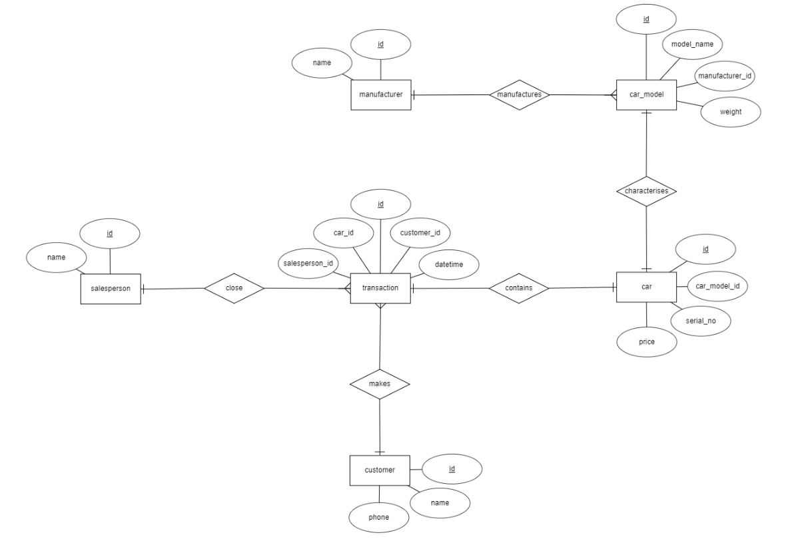

# Section 2: Databases

## Objective

The objective is to create a relational database and design its schema for a car dealership.
In addition, two SQL statements for queries are to be provided.

## Solution

### Setup

Build the docker image:
```bash
docker build -t car-dealership:latest .
```
Run the built docker image as a container in the background and binding host port `5432` to container port `5432`:
```bash
docker container run -d -p 5432:5432 car-dealership:latest
```

### Entity-Relationship Diagram

The chosen schema design of the database attempts to minimize data duplication which results in better data integrity
and less storage overhead.



### Queries

The required queries can be found [here](./sql/queries.sql).