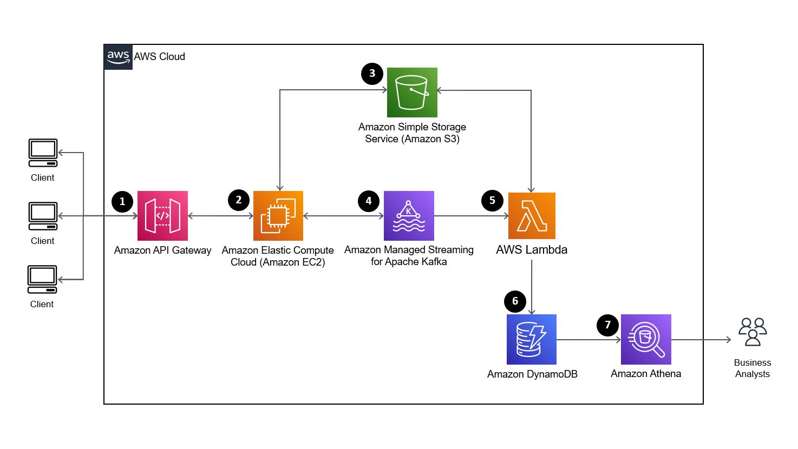

# Section 3: System Design

## Objective

Design a data infrastructure on the cloud for a company whose main business is in processing images with the given 
requirements. 

## Solution

We use the AWS cloud services for our design. The architecture diagram is as shown.

1. Interaction between clients of the company and the their services will be proxied through AWS API Gateway.
It has multiple useful features that help scale the creation, maintenance and operation of APIs when required.
2. The image collection and image streaming applications are assumed to be running on AWS EC2 instances.
It is not a good idea to write large files into Kafka streams since it can potentially overload the system, hence the
image collection application will save the collected images into an Amazon S3 bucket and sends only the metadata of the
images into a Kafka topic which will be consumed by downstream services.
Similarly, the image streaming application will consume messages from another Kafka topic containing the metadata of the
images and read them from an Amazon S3 bucket before streaming them out.
3. The Amazon S3 bucket serves as a blob storage for storing the raw and processed images on different paths in the
same bucket or possibly multiple buckets, if necessary.
Due to the business requirement to keep processed images for at least 7 days, the processed images can be managed using
S3 Lifecycle policies to retain them for at least 7 days.
4. The Amazon Managed Streaming for Apache Kafka is being used since Kafka streams are utilised by the company and it
being managed will reduce the burden of the company managing their own. 
5. The code written by the company's software engineers is assumed to be able to be deployed as an AWS Lambda function.
The function will have to read the raw images from the Amazon S3 bucket and write back processed images. Furthermore,
the AWS Lambda function will store the metadata of the image processed into Amazon DynamoDB.
6. The Amazon DynamoDB is a NoSQL document database that is performant and scales well which is chosen to store the
metadata of the processed images since it is assumed that there are no complex queries involved.
7. Finally, business analysts of the company can utilised the Amazon Athena DynamoDB Connector which enables Amazon
Athena to communicate with DynamoDB.
This will allow them to query tables in DynamoDB using SQL to gather key statistics including number and type of images
processed and by which customers.
