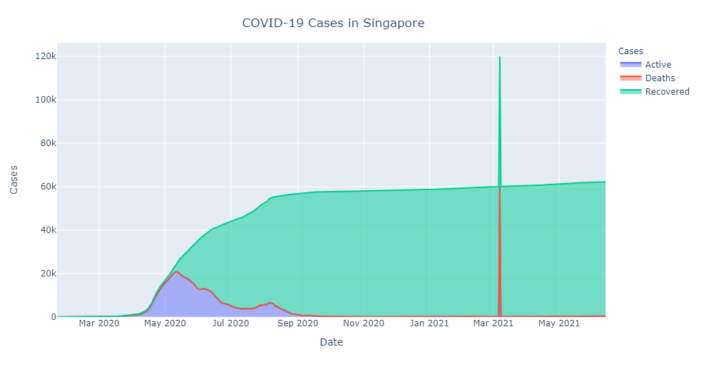

# Section 4: Charts and APIs

## Objective

Display a visualisation representation of the number of COVID-19 cases in Singapore over time.

## Install Dependencies

```bash
pip install pandas plotly
```

## Solution

Usually, it is not a good idea to pull all records down from an api endpoint, especially if the amount of data is huge.
Fortunately, the total amount of data we retrieve from the [endpoint](https://api.covid19api.com/country/singapore) is
relatively small so we will pull all of them down at once. Otherwise, it is recommended to provide the range of dates 
using the `from` and `to` parameters in the same query such as
[this](https://api.covid19api.com/country/singapore?from=2020-03-01T00:00:00Z&to=2020-04-01T00:00:00Z).



An interactive version of the visualisation can be found
[here](https://nbviewer.jupyter.org/github/yixiang91/data-engineer-test/blob/main/sections/4/visualisation.ipynb#Plot).
For displaying on the team's dashboard, it can be either be downloaded as a static image or rendered using 
[dash](https://dash.plotly.com) to be embedded into a webpage, if required.
